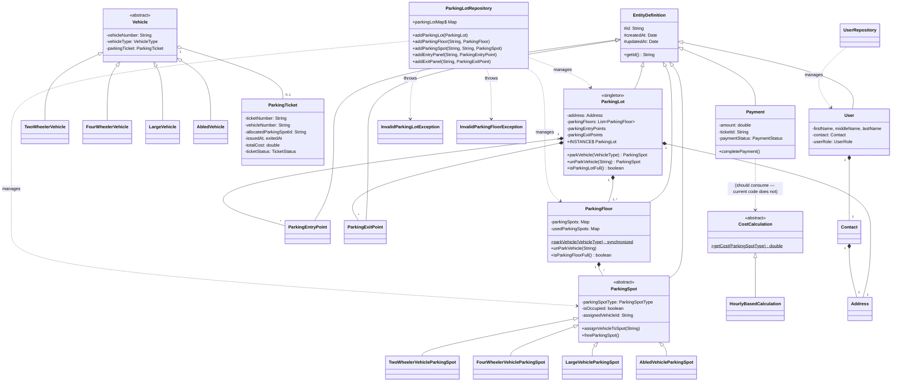

# ParkingLot2 — UML Reference

A walkthrough of the class structure of `ParkingLot2/`, focused on what the diagram should show and the design choices behind it. For the simpler variant, see `../ParkingLot1/`.

---

## 1. What's different from ParkingLot1

| Concern | ParkingLot1 | ParkingLot2 |
|---|---|---|
| Slot-type variation | `ParkingSlotType` **interface** + concrete classes (realization) | `ParkingSpot` **abstract class** + concrete classes (inheritance) |
| Base class | None | `EntityDefinition` — every domain entity extends it (id, createdAt, updatedAt) |
| Vehicle | One concrete `Vehicle` class | `Vehicle` **abstract** + 4 concrete subtypes |
| Cost calculation | `calculateCost` on each slot-type | Separate **`CostCalculation`** abstract class (strategy) |
| References between objects | Object refs (`Vehicle vehicle;`) | Mostly **IDs** (`String assignedVehicleId;`) — denormalized |
| Singleton | Lazy: `if (instance == null) ...` | Eager: `public static INSTANCE = new ParkingLot();` |
| Persistence | None | Explicit **`Repository`** classes |
| Concurrency | Single-threaded | `synchronized` + `ConcurrentLinkedDeque` |
| Errors | `RuntimeException` thrown | Custom `InvalidParkingFloorException`, `InvalidParkingLotException` |

The UML has to convey all of that. The two big additions: the **`EntityDefinition` inheritance hub** and the **abstract-class hierarchies** (`ParkingSpot`, `Vehicle`, `CostCalculation`).

---

## 2. Architecture overview — three layers

ParkingLot2 organizes into three layers. Drawing the UML grouped this way makes it readable; dumping all 25 boxes into one canvas does not.

```
                     ┌─────────────────────────────────────────┐
   APPLICATION       │           ParkingLotApplication         │  ← entry point
                     └────────────────┬────────────────────────┘
                                      │ uses
                     ┌────────────────▼────────────────────────┐
   REPOSITORY        │   ParkingLotRepository   UserRepository │  ← persistence
                     └────────────────┬────────────────────────┘
                                      │ stores / retrieves
                     ┌────────────────▼────────────────────────┐
   DOMAIN MODEL      │  Parking / Vehicle / User / Payment     │  ← entities
                     │       (all extend EntityDefinition)     │
                     └─────────────────────────────────────────┘
```

---

## 3. Domain core — ParkingLot ↔ Floor ↔ Spot

The heart of the diagram. Note the abstract `ParkingSpot` — the major shift from ParkingLot1.

```
                  ┌──────────────────────────────────┐
                  │       EntityDefinition           │  «base entity»
                  ├──────────────────────────────────┤
                  │ # id : String                    │
                  │ # createdAt : Date               │
                  │ # updatedAt : Date               │
                  ├──────────────────────────────────┤
                  │ + getId() : String               │
                  └──────────────▲───────────────────┘
                                 │ extends            (every box below has this arrow up)
              ┌──────────────────┼──────────────────┐
              │                  │                  │
   ┌──────────┴──────┐ ┌─────────┴────┐  ┌──────────┴─────┐
   │   ParkingLot    │ │ ParkingFloor │  │  ParkingSpot   │  ← abstract
   │  «singleton»    │ │              │  │   {abstract}   │
   ├─────────────────┤ ├──────────────┤  ├────────────────┤
   │ -address        │ │ -parkingSpots│  │ -spotType      │
   │ -parkingFloors  │ │ -usedSpots   │  │ -isOccupied    │
   │ -entryPoints    │ ├──────────────┤  │ -assignedVeh   │
   │ -exitPoints     │ │ +parkVehicle │  │   icleId : Str │  ← ID, not Vehicle ref
   │ +INSTANCE {st}  │ │ +unParkVeh.. │  ├────────────────┤
   ├─────────────────┤ │ +isFloorFull │  │ +assignVehicle │
   │ +parkVehicle    │ └──────┬───────┘  │     ToSpot(id) │
   │ +unParkVehicle  │        │          │ +freeParkingSp │
   │ +isParkingLot.. │        │          └────────▲───────┘
   └────────┬────────┘        │                   │
            │ 1               │ 1                 │ extends
            ◆ composition     ◆ composition       │
            │ 1..*            │ *      ┌──────────┼──────────┬──────────┐
            ▼                 │        │          │          │          │
       ParkingFloor           ▼   TwoWheeler  FourWheeler  Large    AbledVehicle
                          ParkingSpot   Vehicle    Vehicle    Vehicle  ParkingSpot
                          (abstract)    ParkingSpot ParkingSpot ParkingSpot
```

**Things to notice:**

1. **`EntityDefinition` is a base class, not an interface** — solid-line inheritance arrows (hollow triangle), not dashed.
2. **`ParkingSpot` is `{abstract}`** — italicize the class name on the whiteboard.
3. **`ParkingLot` ↔ `ParkingFloor` is composition** — when a `ParkingLot` is destroyed, its floors go with it. `1..*` multiplicity (at least one).
4. **`ParkingFloor` ↔ `ParkingSpot` is composition** — same reason, multiplicity `*`.
5. **`ParkingSpot.assignedVehicleId` is a `String`, not a `Vehicle` reference.** Denormalized — there is no UML line from `ParkingSpot` to `Vehicle`, just an attribute. Annotate "FK-style reference."
6. **The `INSTANCE` field on `ParkingLot` is `{static}`** — underline it.

---

## 4. Vehicle hierarchy

```
                     ┌──────────────────────────┐
                     │       Vehicle            │  {abstract}
                     ├──────────────────────────┤
                     │ - vehicleNumber : String │
                     │ - vehicleType : Type     │
                     │ - parkingTicket : Ticket │
                     ├──────────────────────────┤
                     │ + getVehicleType()       │
                     └────────────▲─────────────┘
                                  │ extends
              ┌───────────────┬───┴────────────┬──────────────┐
              │               │                │              │
     TwoWheelerVehicle  FourWheelerVehicle  LargeVehicle  AbledVehicle
```

**Mirror hierarchy:** 4 concrete `ParkingSpot` types, 4 concrete `Vehicle` types, 1:1 mapping enforced via the `ParkingSpotType` and `VehicleType` enums and the `getParkingSpotType(VehicleType)` lookup at `ParkingFloor.java:82`.

`Vehicle` holds a `ParkingTicket` reference (line 10) — aggregation (◇). The ticket can outlive the vehicle's parking session.

---

## 5. Payment + CostCalculation strategy

```
   ┌──────────────────────────┐                ┌───────────────────────────┐
   │       Payment            │                │    CostCalculation        │  {abstract}
   ├──────────────────────────┤                ├───────────────────────────┤
   │ - amount : double        │                │ + getCost(ParkingSpotType)│  {abstract}
   │ - ticketId : String      │  ◇ aggregation │      : double             │
   │ - paymentStatus : Status │ ─────────────► └─────────────▲─────────────┘
   │ - initiatedDate          │   (Payment        ╎  ╎       │
   │ - completedDate          │    consumes a     ╎  ╎       │ extends
   ├──────────────────────────┤    strategy)      ╎  ╎       │
   │ + completePayment()      │                ┌──┴──┴───────┴──────────┐
   └──────────────────────────┘                │ HourlyBasedCalculation │
                                               └────────────────────────┘
   ┌──────────────────────────┐
   │     ParkingTicket        │                ┌──────────────────────────┐
   ├──────────────────────────┤                │   <<enumeration>>        │
   │ - ticketNumber : String  │                │     PaymentStatus        │
   │ - vehicleNumber : String │◄──────────────►│ ├ INITIATED              │
   │ - allocatedParkingSpotId │ FK-style        │ ├ PAID                  │
   │ - issuedAt, exitedAt     │ string refs    │ └ FAILED                 │
   │ - totalCost : double     │                └──────────────────────────┘
   │ - ticketStatus : Status  │
   └──────────────────────────┘
```

**Key UML decisions:**
- `CostCalculation` is **abstract** with one concrete subtype now — this is a *strategy* pattern done via inheritance instead of an interface. On a whiteboard, label it `«strategy»`.
- `Payment` does **not** currently hold a reference to `CostCalculation` in the code — that's a design smell. A refined version would add `- calculator : CostCalculation` and show the aggregation arrow.
- `ParkingTicket` does **not** extend `EntityDefinition` — the only model that doesn't. Either inconsistency or deliberate; worth flagging.

---

## 6. User domain + Repository layer

```
   ┌──────────────────────────┐         ┌──────────────────────────┐
   │         User             │         │   ParkingLotRepository   │
   ├──────────────────────────┤         ├──────────────────────────┤
   │ - firstName              │         │ + parkingLotMap {static} │
   │ - middleName, lastName   │         │ + parkingLotList {static}│
   │ - contact : Contact      │ ◆──1── ◀┤ + addParkingLot()        │
   │ - userRole : UserRole    │         │ + getParkingLotById()    │
   │ - lastAccessedAt         │         │ + addParkingFloor()      │
   └────────┬─────────────────┘         │ + addParkingSpot()       │
            │                           │ + addEntryPanel()        │
            │ 1                         │ + addExitPanel()         │
            ◆ composition               └──────────────────────────┘
            │ 1
   ┌────────┴─────────────────┐         ┌──────────────────────────┐
   │       Contact            │         │      UserRepository      │
   ├──────────────────────────┤         └──────────────────────────┘
   │ - email, phone           │
   │ - address : Address      │ ◆──1──┐
   └──────────────────────────┘       ▼
                                ┌──────────┐
                                │ Address  │
                                └──────────┘
```

The repository layer is **dependency**, not association, to most of what it touches — it operates on entities passed in, doesn't hold them as fields (except for the static maps). Dashed arrows from `ParkingLotRepository` to `ParkingLot`, `ParkingFloor`, `ParkingSpot`, `ParkingEntryPoint`, `ParkingExitPoint`. Don't draw all 5 — group them or label "uses Parking* entities".

---

## 7. Full diagram (Mermaid)



---

## 8. ParkingLot1 vs ParkingLot2 — UML diff

| UML element | ParkingLot1 | ParkingLot2 | Tradeoff |
|---|---|---|---|
| Slot-type variation | `<<interface>>` realization (`╌╌▷`) | abstract class inheritance (`──▷`) | Interface = pure contract; abstract = shared state + contract. ParkingLot2 has no shared state in `ParkingSpot` worth showing, so the choice is debatable — interfaces would also work. |
| Cross-entity references | direct object refs (lines everywhere) | string IDs (fewer lines) | ID-based design = fewer UML lines but the constraints are no longer enforced by the type system. Easier persistence, weaker compile-time safety. |
| Base class | none | `EntityDefinition` (inheritance hub) | A "god parent" class is a tradeoff — DRY for `id/createdAt/updatedAt`, but forces all entities into one taxonomy. |
| Strategy | implicit in `ParkingSlotType` interface | explicit `CostCalculation` abstract class | Separating "what kind of spot" from "how to price" is cleaner. ParkingLot1 conflates them. |

---

## 9. Self-check questions

If you can answer these without re-reading, you've understood the diagram:

1. Which arrows are dashed and why? *(realization, dependency, abstract-method markers)*
2. Why is `ParkingSpot.assignedVehicleId` a `String` and not a `Vehicle` reference? What's the tradeoff?
3. Is `Payment ─ CostCalculation` an association or a dependency in the **current** code? Should it be?
4. Which entity *doesn't* extend `EntityDefinition`, and is that intentional?
5. Why is `ParkingFloor.parkVehicle()` `synchronized`? What does that tell you about the assumed runtime?
