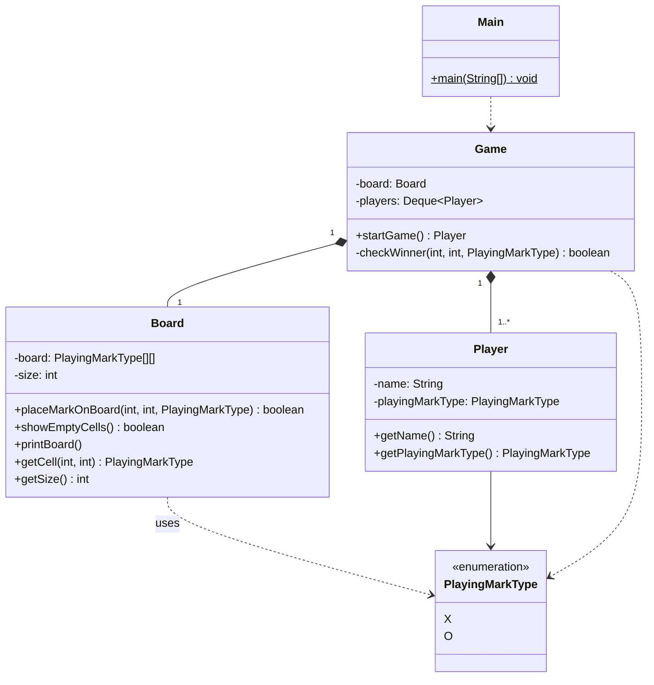

# TicTacToe — UML Reference

A small, 5-class LLD problem. Useful as a baseline for UML practice before tackling the bigger questions like `ParkingLots/`.

---

## 1. Inventory

| File | Type | Role |
|---|---|---|
| `Main.java` | concrete | Entry point |
| `Game.java` | concrete | Game loop + win-check logic |
| `Models/Board.java` | concrete | 2D grid state + place/check operations |
| `Models/Player.java` | concrete | Player name + assigned mark type |
| `enums/PlayingMarkType.java` | enum | `X` or `O` |

> An earlier version of this question carried an orphan `PlayingMark` / `PlayingMarkX` / `PlayingMarkO` class hierarchy that nothing referenced — pure dead code. It was removed; X vs O is fully captured by the `PlayingMarkType` enum, since there is no behavioral variation between the two marks.

---

## 2. Reading the code → picking relationships

Walk each field and method signature, ask the lifecycle question, pick the arrow:

**`Game.java`:**
```java
private Board board;                                  // Game owns Board
private Deque<Player> players = new LinkedList<>();   // Game owns Players
```
`Game` constructs both `Board` and `Player` in its constructor. When the `Game` ends, they're gone. **Composition** (◆) — multiplicity `1` for the board, `1..*` for the players (the constructor currently adds 2).

**`Board.java`:**
```java
private PlayingMarkType[][] board;
private int size;
```
The board holds a 2D array of the enum directly — there is no `PlayingMark` object. Methods like `placeMarkOnBoard` take a `PlayingMarkType` parameter. Relationship to the enum = **association** via the field; the array stores enum values, not object references.

**`Player.java`:**
```java
private String name;
private PlayingMarkType playingMarkType;
```
Player → `PlayingMarkType` is an **association** (1 enum value per player).

**`Main.java`:**
```java
Game game = new Game();
Player wonPlayer = game.startGame();
```
**Dependency** (dashed) on `Game` and `Player` — instantiated and used, not held as fields.

---

## 3. ASCII diagram

```
                       ┌──────────────────────────┐
                       │          Main            │
                       ├──────────────────────────┤
                       │ + main(String[]) {static}│
                       └────────────┬─────────────┘
                                    ╎ depends on
                                    ▼
                       ┌──────────────────────────┐
                       │          Game            │
                       ├──────────────────────────┤
                       │ - board : Board          │
                       │ - players : Deque<Player>│
                       ├──────────────────────────┤
                       │ + startGame() : Player   │
                       │ - checkWinner(...)       │
                       └──┬─────────────────────┬─┘
                          │ 1                   │ 1..*
                          ◆ composition         ◆ composition
                          ▼                     ▼
              ┌──────────────────┐    ┌──────────────────────┐
              │      Board       │    │       Player         │
              ├──────────────────┤    ├──────────────────────┤
              │ - board:         │    │ - name : String      │
              │   PlayingMarkType│    │ - playingMarkType :  │
              │   [][]           │    │      PlayingMarkType │
              │ - size : int     │    ├──────────────────────┤
              ├──────────────────┤    │ + getName() : String │
              │ + placeMarkOnBd. │    │ + getPlayingMarkType()│
              │ + showEmptyCells │    └──────────┬───────────┘
              │ + printBoard()   │               │ 1
              │ + getCell(r,c)   │               │
              │ + getSize()      │               │
              └────────┬─────────┘               │
                       │ uses (array element)    │
                       ▼                         ▼
                  ┌──────────────────────────────────┐
                  │ «enumeration»  PlayingMarkType   │
                  ├──────────────────────────────────┤
                  │  X                               │
                  │  O                               │
                  └──────────────────────────────────┘
```

**The relationships, summarized:**

| Source | Target | Type | Symbol | Multiplicity |
|---|---|---|---|---|
| Game | Board | composition | ◆─── | 1 |
| Game | Player | composition | ◆─── | 1..* (currently 2) |
| Board | PlayingMarkType | association | ─── | uses enum as array element |
| Player | PlayingMarkType | association | ─── | 1 |
| Main | Game | dependency | ╌╌▷ | — |
| Game | PlayingMarkType | dependency | ╌╌▷ | (method param in `checkWinner`) |

---

## 4. Mermaid



---

## 5. Design observations

1. **`Game` borderline-violates SRP.** It owns both the game loop (`startGame`) and the win-detection logic (`checkWinner`). A cleaner split would extract a `WinChecker` strategy. Worth revisiting under SRP / Strategy material.
2. **No interfaces.** Every relationship is concrete-to-concrete. Fine for two human players — but to add an AI player you'd want a `Player` interface with `decideMove(Board)` and concrete `HumanPlayer` / `AIPlayer` subclasses.
3. **No state machine.** Game state (in-progress, won, tied) is implicit in the `isGameNotWon` boolean and the `return playerTurn` / `return null` in `startGame`. A `GameStatus` enum or the State pattern would model this cleanly.
4. **`Board` is dumb storage.** It doesn't know if the game is won — `Game.checkWinner` peeks at cells via `getCell`. Encapsulation leak: `Game` reaches into the board instead of asking the board "is there a winning line?". A simple refactor would move `checkWinner` (or just `hasWinningLineFor(PlayingMarkType)`) onto `Board`.

---

## 6. Right level of abstraction

| Problem | Variability | Right tool |
|---|---|---|
| TicTacToe X/O | None — display char only | Enum (this design) |
| ParkingLot cost-per-spot | 4 different formulas | Interface or abstract class |
| ParkingLot vehicle types | Same structure, different categories | Enum + lookup, OR abstract class hierarchy |

The lesson: **match the amount of abstraction to the variability you actually have.** The deleted `PlayingMark` hierarchy was a textbook over-abstraction — no behavior varied between X and O, so a class hierarchy added nothing.

---

## 7. Self-check

1. Name every relationship type in this diagram. *(composition, association, dependency — three total now; inheritance is gone with the orphan hierarchy)*
2. Which class violates SRP and why? *(`Game` — orchestration + win-detection)*
3. To add an AI player, what changes in the UML? *(introduce a `Player` interface/abstract class with `decideMove(Board)`; `HumanPlayer` reads from `Scanner`, `AIPlayer` computes — `Game.players` now holds the abstraction)*
4. Why is `Board ──> PlayingMarkType` an association rather than composition? *(the enum values are shared global constants, not owned instances — there's nothing to "own")*
